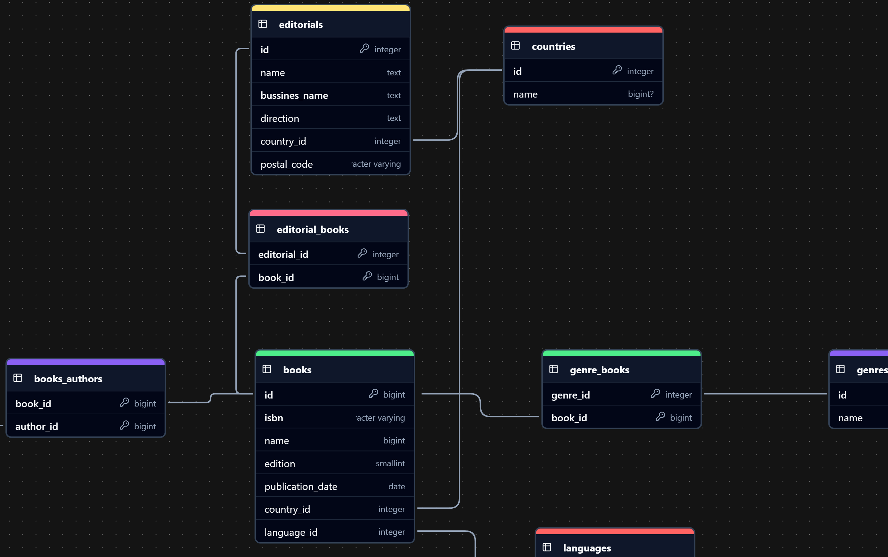

# Sitema de prueba de una biblioteca

## Tecnologías usadas

- [AdonisJS 6](https://adonisjs.com/): Framework de desarrollo web con TypeScript para NodeJS
- [Lucid ORM](https://lucid.adonisjs.com/docs/introduction): Constructor de queries SQL y ORM de ActiveRecord
- [VineJS](https://vinejs.dev/docs/introduction): Validación de datos para NodeJS

## Concepetos implementados

- Migrations
- Validacion de datos
- Especifiación de rutas
- Uso de Queries
- Uso de Modelos Active Record
- 

## Modelo relacional

## Rutas disponibles

| METHOD | ROUTE                        |
| ------ | ---------------------------- |
| GET    | /                            |
| GET    | /api/v1/languages            |
| POST   | /api/v1/languages            |
| GET    | /api/v1/languages/:id        |
| PUT    | /api/v1/languages/:id        |
| PATCH  | /api/v1/languages/:id        |
| DELETE | /api/v1/languages/:id        |
| GET    | /api/v1/authors              |
| POST   | /api/v1/authors              |
| GET    | /api/v1/authors/:id          |
| PUT    | /api/v1/authors/:id          |
| PATCH  | /api/v1/authors/:id          |
| DELETE | /api/v1/authors/:id          |
| GET    | /api/v1/genres               |
| POST   | /api/v1/genres               |
| GET    | /api/v1/genres/:id           |
| PUT    | /api/v1/genres/:id           |
| PATCH  | /api/v1/genres/:id           |
| DELETE | /api/v1/genres/:id           |
| GET    | /api/v1/countries            |
| POST   | /api/v1/countries            |
| GET    | /api/v1/countries/:id        |
| PUT    | /api/v1/countries/:id        |
| PATCH  | /api/v1/countries/:id        |
| DELETE | /api/v1/countries/:id        |
| POST   | /api/v1/editorials           |
| GET    | /api/v1/editorials           |
| GET    | /api/v1/editorials/:id       |
| PUT    | /api/v1/editorials/:id       |
| PATCH  | /api/v1/editorials/:id       |
| DELETE | /api/v1/editorials/:id       |
| GET    | /api/v1/books                |
| POST   | /api/v1/books                |
| GET    | /api/v1/books/:id            |
| PUT    | /api/v1/books/:id            |
| PATCH  | /api/v1/books/:id            |
| DELETE | /api/v1/books/:id            |
| GET    | /api/v1/filters/books/genres |
